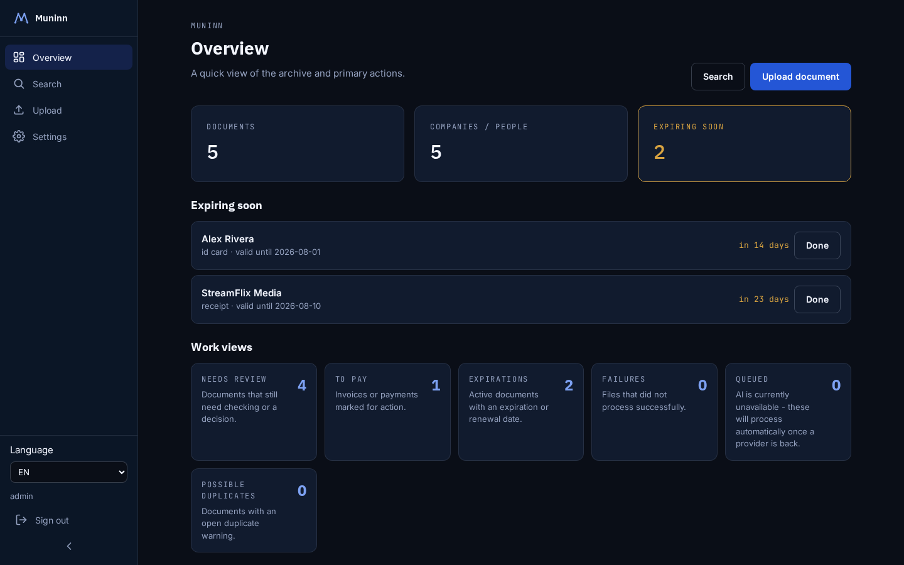
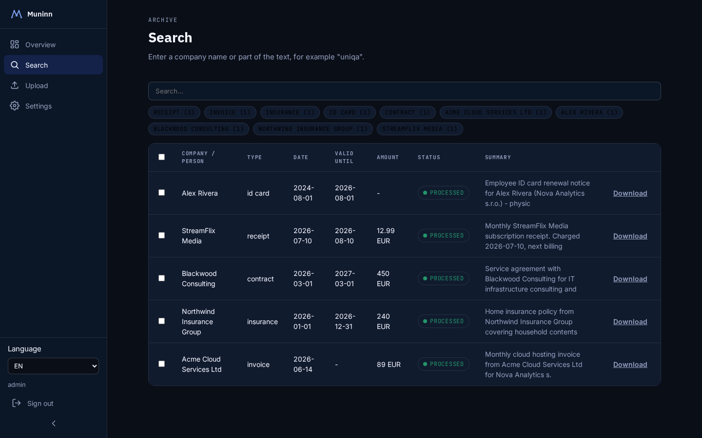
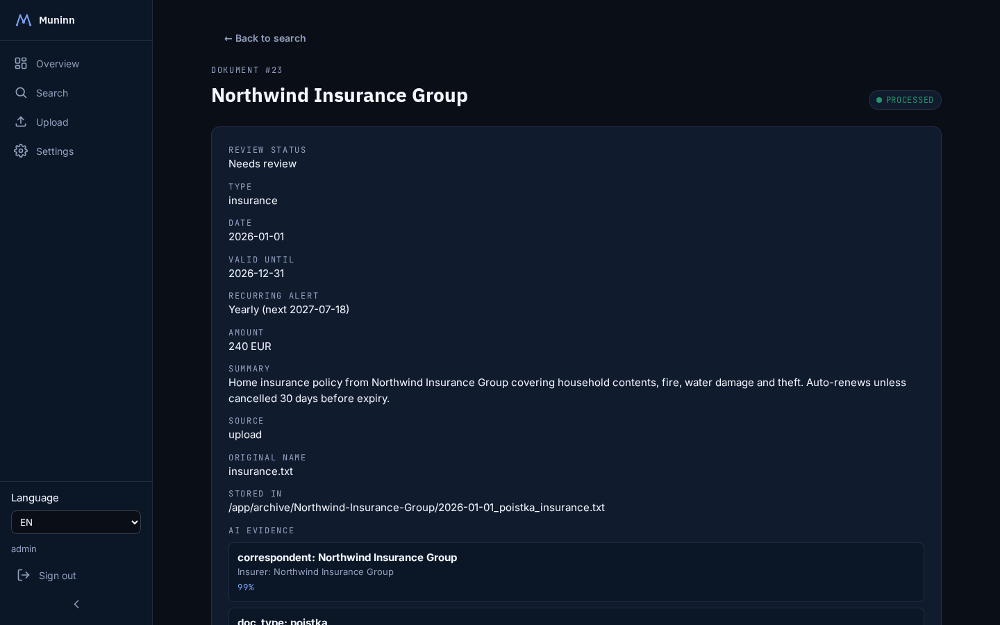
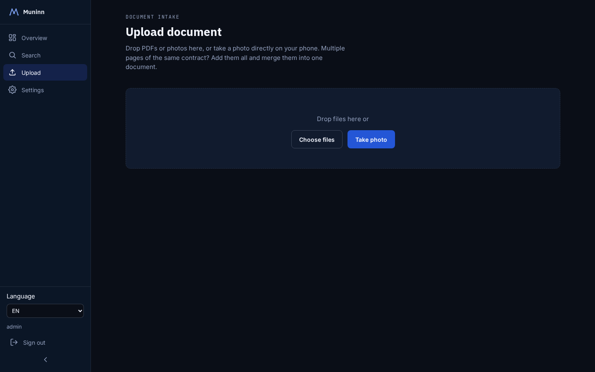
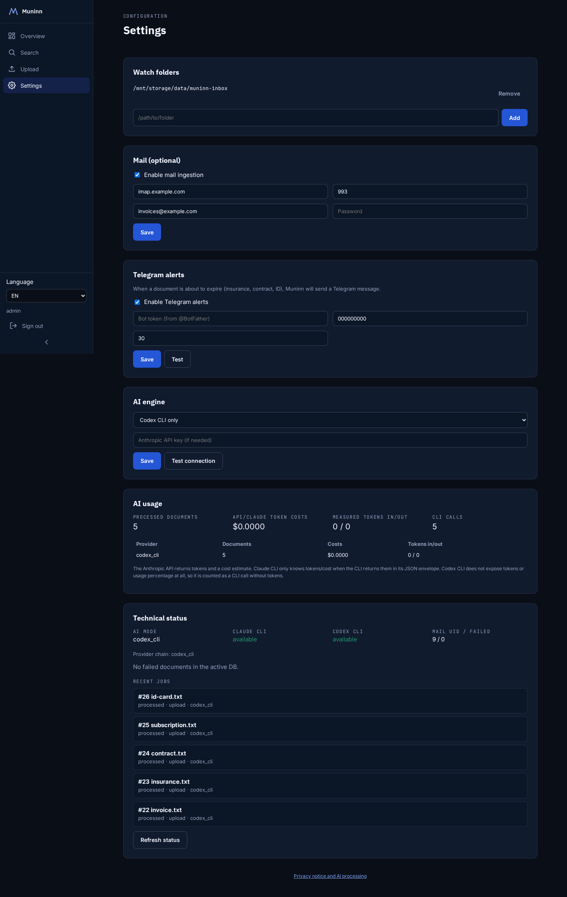

# Muninn

Self-hosted archive for the documents you actually need to find again fast —
invoices, contracts, insurance policies, IDs, birth certificates, whatever.
Drop in a photo, a PDF, or forward an email; an AI extraction pass reads it,
figures out who/what it's from, what kind of document it is, the date, the
amount, and a one-line summary, files it away, and indexes the full text —
so later you just type "uniqa" and every Uniqa document you ever archived
shows up, snippet and all.

Named after Muninn, one of Odin's two ravens (memory) — fits the existing
naming in this homelab: Yggdrasil (server), Heimdall (ops dashboard),
Bifrost (discovery), Midgard (brand/web).



## Why this exists

Most self-hosted document managers (Paperless-ngx, Docspell, Mayan EDMS)
are OCR + regex/rule-based: you write matching rules per correspondent,
tune consumption templates, and the "understanding" is shallow. Muninn is
LLM-native from the start — the model actually reads the document and
reasons about what it is, with no rules to maintain.

It's also built to **reuse an AI coding subscription you already have**
(Claude Code / Codex CLI) instead of requiring a separate paid API key.
If you're a developer with a Claude or ChatGPT subscription for coding,
your document archive doesn't need its own billing.

## Features

- **Ingestion from anywhere**: web upload (drag-drop or snap a photo on
  your phone), a watched folder on disk, or an IMAP mailbox (attachments
  *and* HTML/plain-text mail bodies with no attachment — e.g. order
  confirmations — both get archived).
- **Multi-page merge**: photographed a 10-page contract one page at a
  time? Stage all the pages, reorder them, and merge into a single PDF
  before it ever reaches the AI — one archived document, one coherent
  extraction, instead of ten fragments.
- **AI provider chain with automatic fallback**: Claude CLI → Codex CLI →
  Anthropic API key, in that order, per document. If a provider is
  actually unavailable (rate limit, auth issue, no network) rather than
  just unable to read this particular file, the document is queued
  instead of marked failed — a background loop retries it automatically
  once a provider comes back, updating the same record in place.
- **Real full-text search**: PDF/XLSX/HTML/ODT text is extracted
  server-side (not just the AI's short summary) and indexed with SQLite
  FTS5; matches come back with a highlighted snippet showing exactly
  where the hit was.
- **Expiry & recurring reminders**: track a document's expiry date
  (insurance renewal, ID expiry, contract end) and get a Telegram message
  before it lapses. Some things need a periodic nudge instead of a single
  deadline — insurance policies, subscriptions — so a document can also
  be set to notify monthly/quarterly/yearly independent of any expiry
  date.
- **Review workflow**: documents move through review states (needs
  review / to pay / done / rejected / archived) with saved views on the
  dashboard for each, plus fuzzy duplicate detection (similar
  correspondent + amount + nearby date, not just an exact file hash) that
  flags likely duplicates for a manual decision.
- **Audit trail**: every ingest attempt and every change to a document is
  logged (who/what/when), visible per-document. Deletions are recorded
  separately (in `document_deletions`, which deliberately survives the
  deleted row) since a document's own event history goes away with it.
- **Bilingual UI** (Slovak/English) with a language switcher.
- **Security-conscious by design**: the AI is pointed at one isolated,
  per-job temp copy of the document being processed — never at the shared
  inbox/watch-folder it came from. Secrets (mail password, Telegram bot
  token, API key) are encrypted at rest. Session-cookie auth with CSRF,
  PBKDF2 password hashing with login rate-limiting, a setup token for
  first-admin creation, archived documents served download-only (no
  in-app rendering of `.html`/`.svg`), a CSP, and a non-root container.

  **Known limit, stated plainly:** this is *not* a sandbox. With the CLI
  providers the model runs on the host/container with that user's
  filesystem read access — `codex -s read-only` restricts writes and
  network, not reads, and `claude -p --allowedTools Read` restricts which
  tools it may call, not which paths `Read` may touch. A prompt-injected
  document could in principle instruct the model to read another file and
  echo it into the extracted text. Run the CLI providers only against
  documents you'd be willing to hand the provider anyway, or use the
  `anthropic_api` provider (which sends only the document itself).
- **GDPR-conscious**: account creation requires explicit consent to
  AI processing (documents are sent to a third-party provider for
  extraction); deleting a document removes the file from disk, not just
  the database row; a plain-language privacy notice explains what's
  processed and where it goes.

## Screenshots

| | |
|---|---|
|  |  |
|  |  |

## Deployment

Runs as a **single process** (FastAPI serves the built React frontend
directly, no nginx/Caddy) — so it deploys equally well as one Docker
container or one systemd service, on any Linux host, not tied to a
specific machine. Verified end-to-end on two different physical machines
across two different CPU architectures (aarch64 and x86_64).

See [INSTALL.md](INSTALL.md) for both deployment paths, and
[ARCHITECTURE.md](ARCHITECTURE.md) for the design decisions and their
rationale (including the ADRs in `docs/adr/`).

## Testing

```
cd backend && pip install -r requirements.txt -r requirements-dev.txt
pytest
```

See [TESTING.md](TESTING.md) for what's covered.

## Status

In active use for real documents. See `docs/adr/` for architectural
decisions made during development.

## License

Apache-2.0, see [LICENSE](LICENSE).
